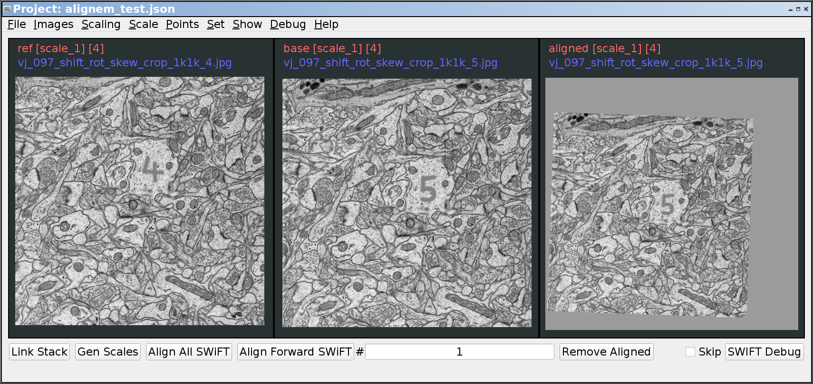

.. _alignem_information:

************************
AlignEM Overview
************************

AlignEM is a Python program for managing alignment projects.

An alignment project is typically a series of images representing
sections or slices through a 3-D object. AlignEM provides the ability
to import a series of such images, view them as a "stack", and apply
an alignment alogorithm to generate aligned images. The following images
show a stack of original (unaligned) images on the left, and a stack of
aligned images on the right.

.. image:: ./images/unaligned_small.gif
.. image:: ./images/aligned_small.gif

===============
AlignEM
===============
AlignEM is intended to be a generic alignment tool capable of supporting
multiple alignment algorithms. When AlignEM is run by itself, it acts
mostly as an image stack viewer:

.. image:: ./images/AlignEM.png

===============
AlignEM SWiFT
===============

AlignEM_SWiFT is a Python program that uses the AlignEM framework for
aligning image stacks using the SWiFT-IR algorithm. AlignEM_SWiFT
generally defines three images at each level of the stack:

  - Reference (often shown as "ref")
  - Base (often shown as "base")
  - Aligned (often shown as "aligned")

These three images can be seen here:

.. toctree::
	:maxdepth: 1

   startup
   default_menu
   other_menus
   other_areas
   other_regions
   shortcuts
   mesh_edit
