.. _alignem_information:

************************
AlignEM SWiFT - Quick Example
************************

======
Start Program
======

Start AlignEM SWiFT with the following command:

.. code-block:: mdl

    python alignem_swift.py

.. note::

   The alignem_swift.py program can be run from either Python 2 or Python 3.

AlignEM SWiFT can be run with several command line options (use -h for a list).
It is often helpful to start it with a desired "debug" level for more output:

.. code-block:: mdl

    python alignem_swift.py -d 50

When AlignEM SWiFT starts, it should appear as an empty window:

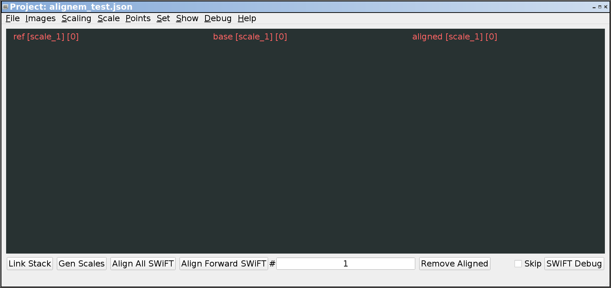

======
Load "Base" Images
======

Load images from the "Images / Import into / base" menu:

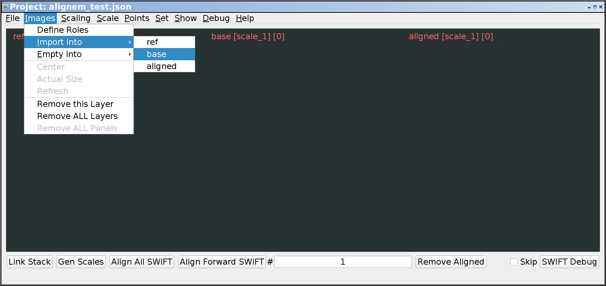

That will bring up a dialog box allowing you to select multiple images:

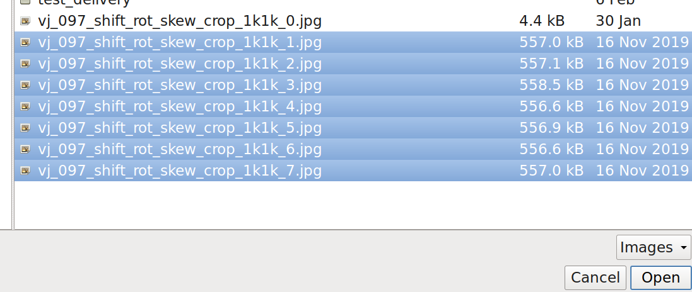

Select the images to import, and click the "Open" button. That will import
all of the selected images into the "base" image stack:

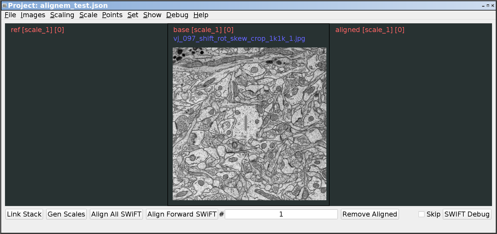

If you scroll your mouse wheel, you should be able to move through the
stack of images shown in the "base" (center) stack.

======
Link "Reference" Images
======

In order to set the relationship between the images in the stack, use
the "Link Stack" button in the lower left corner of the window. This
assigns a reference image to each base image. The reference image for
each image (when using SWiFT-IR) will be the previous image in the stack.

.. note::

   The first image will not have a reference image, so you will need
   to scroll through the stack to see the reference images that have
   been added with the "Link Stack" button.

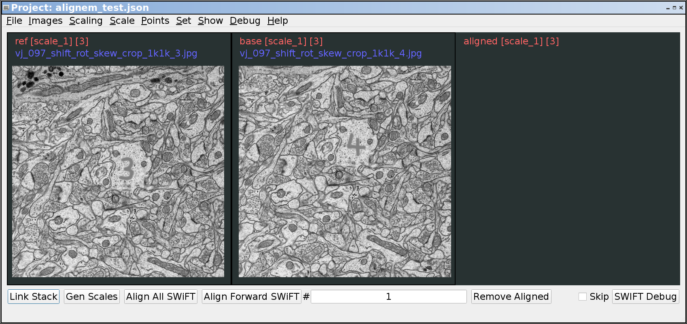

======
Set a Destination for Generated Images
======

An Alignem SWiFT project should define a location for all of its
project images (base images, scaled images, aligned images). This
must be set before any images can be generated (including both
scaled images and aligned images). Set the dest path with
the "File / Set Destination" menu item:

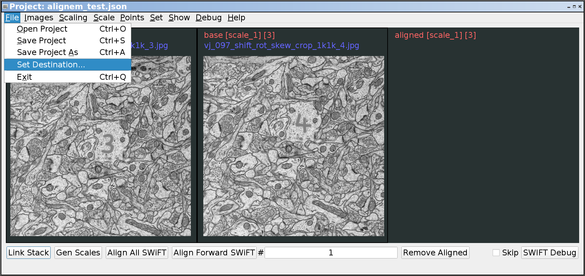

This will bring up a dialog box where a directory can be optionally
created and selected. It's generally a good idea to create the new
dest directory as a subdirectory where the original images exist.

======
Define Scales
======

Large images can be aligned much faster by using multiple "scales".
The "scale number" is the reduction factor used by that scale. So
a scale number of "1" is the full size image. A scale number of "2"
will be half as wide and half as tall. A scale number of "3" will
be 1/3 in both width and height as the original image.

An alignment project can use multiple scales. These scales are chosen
in the "Scaling / Define Scales" menu:

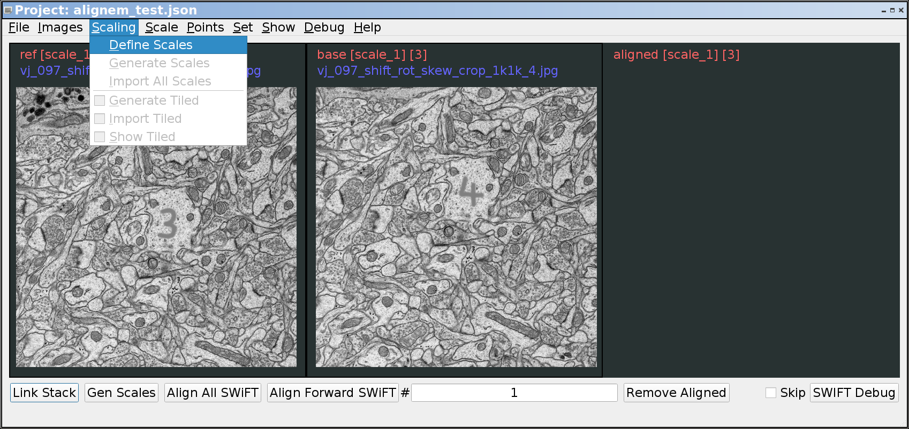

The "Scaling / Define Scales" menu will bring up a dialog box where
the individual scales can be entered (separated with spaces):

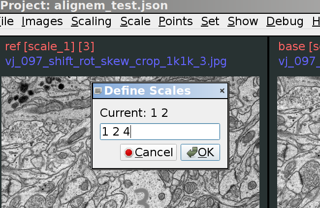

In that example, the scales were chosen to be 1, 2, and 4.

======
Generate Scaled Images
======

Even if only a single scale is used (defaults to 1), the images
must be copied (or linked) from their original location to the
dest directory structure. This is accomplished with the
"Gen Scales" button next to the "Link Stack" button. Click it
one time to copy/link/generate the images needed for the project.

======
Save the Project
======

It's a good idea to save the project before starting the
alignment. It's generally a good idea to save the project
file at the directory directly above the dest directory.
Many file names in a project file are stored relative to either
the project or the dest, so keeping them together makes
this relative path shorter and easier to understand. The project
can be saved with either the "Save As" (first time) or "Save"
menu options.

======
Choose a Scale to Align
======

The scaled image sets can be chosen from the "Scale / #" menu:

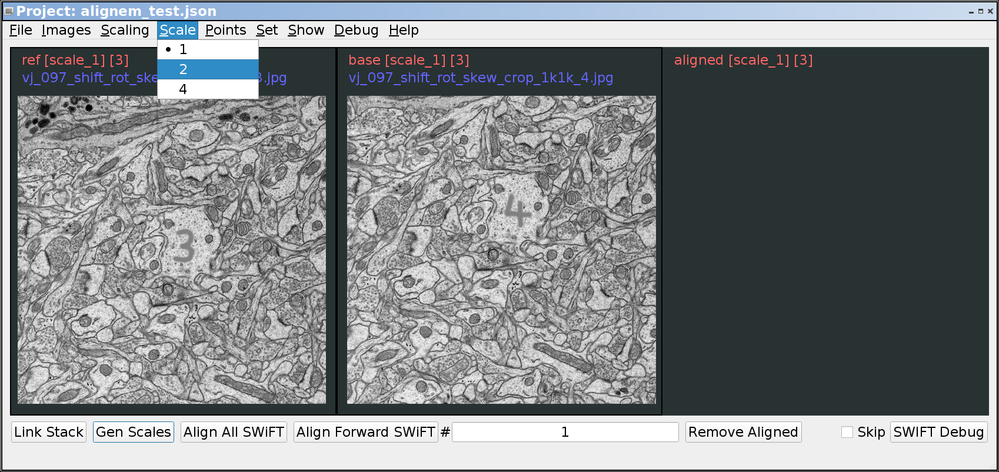

Usually its best to start with the smallest images first. These
will have the largest scale number. In this example (with scales
1, 2, and 4), the first scale to align would be scale 4. Note that
the images are currently shown with the current zoom regardless of
the scale. So selecting scale 4 will show the images at 1/4 of their
original size:

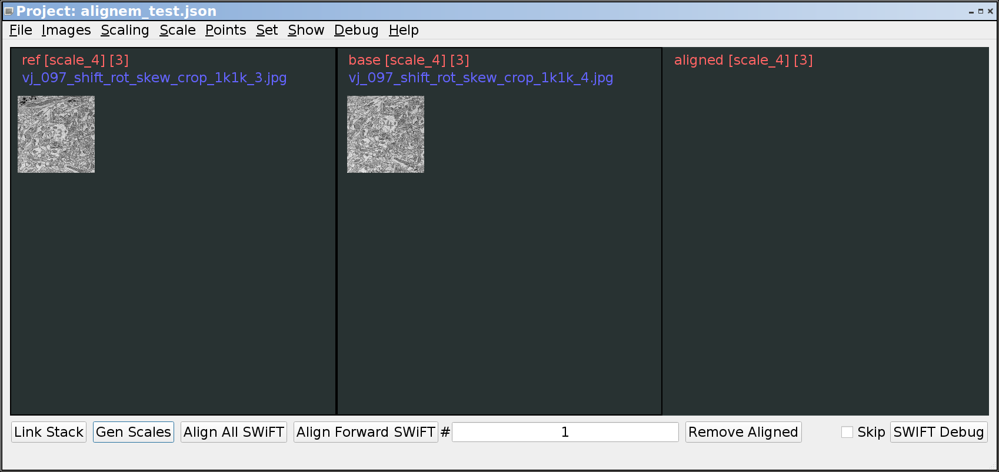

You may zoom these images as needed with the shifted scroll wheel.
You may also move the images with "left click and drag".

======
Align the Images
======

Align the images by pressing the "Align All SWiFT" button next
to the "Link Stack" and "Gen Scales" buttons. Depending on the
image size, image scale, and number of images, this may be quick
or may take a long time. There is currently no feedback other
than whatever may be printed in the console where the program
was originally run. When the alignment is complete, you will
see the newly aligned images in the "aligned" stack on the
right:

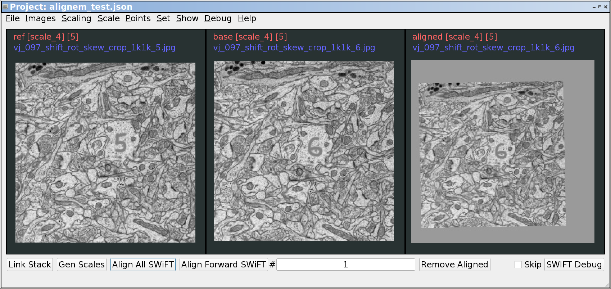

Note that each image shows the image role (ref, base, aligned)
along with the current scale and the current "layer" in the stack.

Once a particular scale has been aligned, you may move to the next
scale to align those images. Eventually, the "scale_1" images will
be aligned:

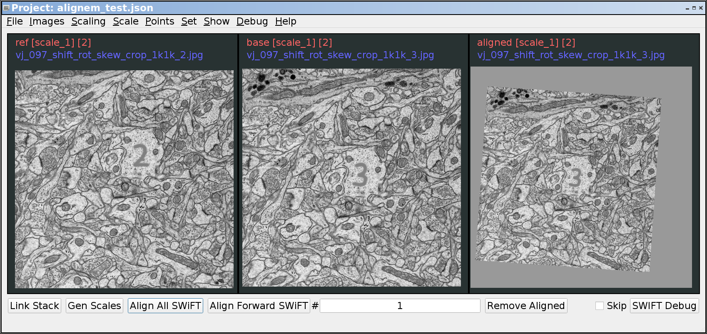

.. toctree::
	:maxdepth: 1

   startup
   default_menu
   other_menus
   other_areas
   other_regions
   shortcuts
   mesh_edit
